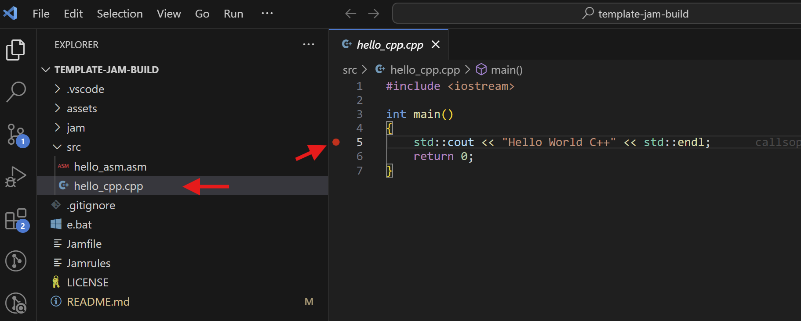
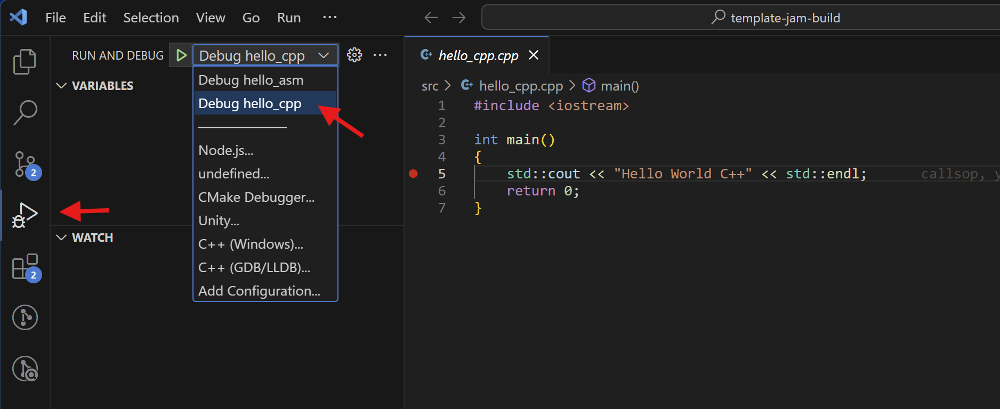
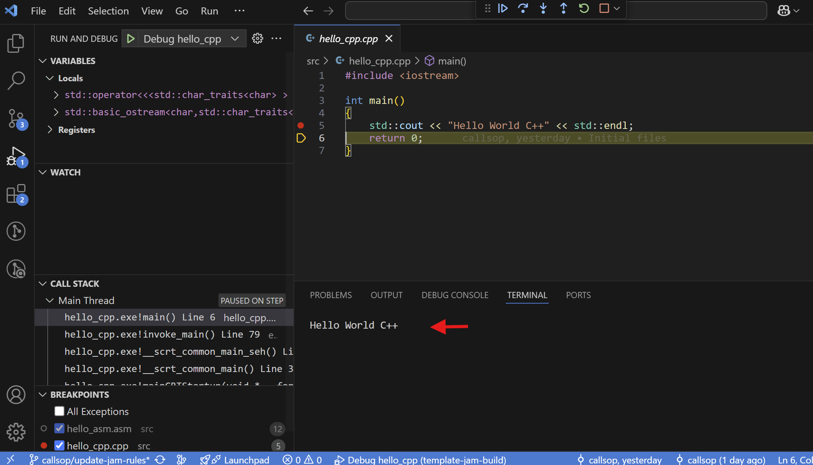
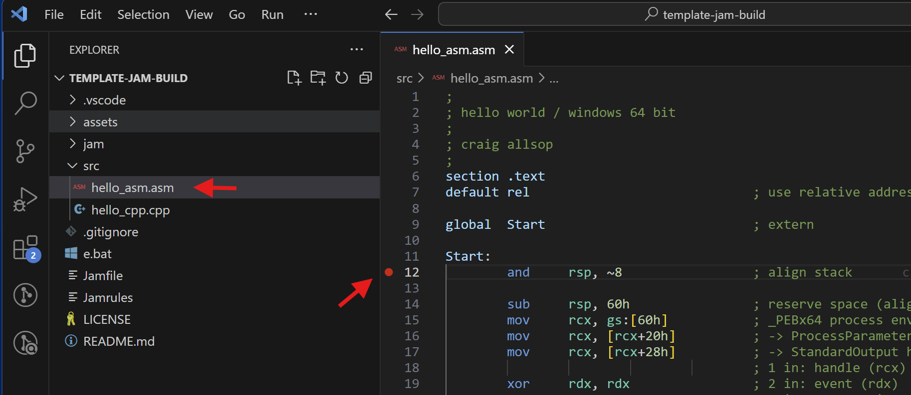
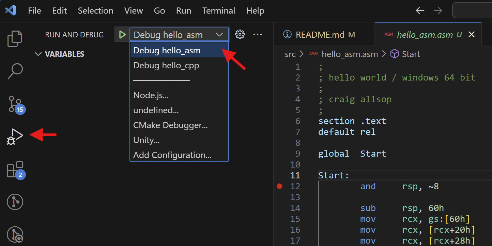
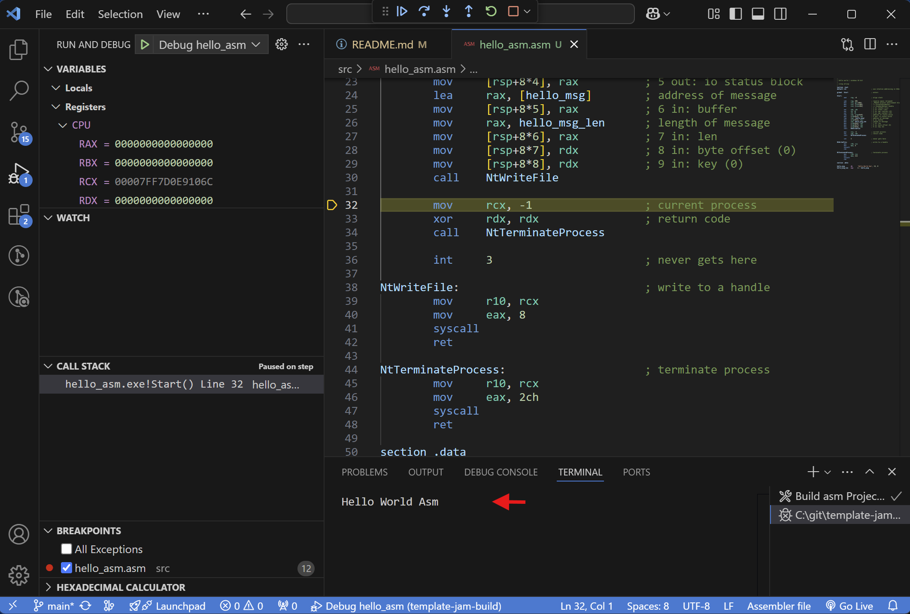

# About

This is a template project for building console projects via jam. 

Included is a simple hello world source in C++ and 64 bit assembly for Windows (10/11). 
If one or the other isn't required, just delete that source file.

> Jam, which is 'just another make', has been around for long time (2000) but I think
> hardly anyone knows it. It provides fast incremental builds. It was developed
> by Christopher Seiwald at Perforce but no longer maintained. There are other versions
> that are based on Jam, e.g. boost-jam, ftJam, etc. and often serious projects 
> customized it to support 10s of thousands of targets, however the stock version is simple
> and still useful if you know how it works.

## Requirements

1. Install Jam 2.5.

2. Install Visual Studio 2022 Community.
   - Check 'Desktop development with C++' and:
     - MSVC v143 - VS 2022 C++ x64/x86 build tools
     - Windows 11 SDK
     - C++ CMake tools for Windows
     - Testing tools core features - Build tools
     - C++ Address Sanitizer

3. Install Visual Studio Code. For editing/debugging in Visual Studio Code.

   Follow the steps 1 to 3 from the prerequisites here:
   https://code.visualstudio.com/docs/cpp/config-msvc#_prerequisites

The following are required for compiling/debugging assembly:

4. Install NASM 2.16. 

5. In VSCode/Extensions: Install [Asm Code Lens](https://marketplace.visualstudio.com/items?itemName=maziac.asm-code-lens)
(by maziac). For formatting, intellisense on assembly files.

## Debugging C++ in VSCode

After cloning the source, launch VSCode from cmd window with 'e.bat'.

Open `hello_cpp.cpp` and place breakpoints with F9 in the source:



Go to the debug tab (left) in Visual Studio Code and choose from the drop down and choose desired
executable to debug 'Debug hello_cpp':



Press F5 to compile and debug the application, which should write the hello world message to the
terminal.




## Debugging Assembly in VSCode

Open `hello_asm.asm` and place breakpoints with F9 in the source:



Go to the debug tab (left) in Visual Studio Code and choose from the drop down and choose desired
executable to debug 'Debug hello_asm':



Press F5 to compile and debug the application, open the registers on the left, step with F10 over
NtWriteFile, which should write the hello world message to the terminal. This function writes the
'message' to the standard output handle provided by the os to console apps:



> [!WARNING]
> Performing syscalls like this is just for demonstration, use it at your own risk, new
> versions of Windows may change these syscalls so prefer to call these functions in ntdll.dll.

## Command Line Compiling

The compiling is done via jam, which is just another make, its fast and incremental. To 
build from command line run:

``` 
C:\git\template-jam-build> jam hello_asm
...found 13 target(s)...
...updating 4 target(s)...
As build\release\hello_asm.obj
Link build\release\hello_asm.exe 
As build\debug\hello_asm.obj 
Link build\debug\hello_asm.exe 
...updated 4 target(s)... 
```

Outputs are in `build\debug` or `build\release`. Other possible targets are: 'debug', 'release', 'hello_cpp'.

To clean up:

```
C:\git\template-jam-build> jam clean
...found 2 target(s)...
...updating 1 target(s)...
Clean clean
...updated 1 target(s)...
```

Note: this will not remove empty directories.

## Structure

 | Directory | Description
 | ----------|--------------------------------------------------------------|
 | .vscode/  | Visual Studio Code configuration files.
 | assets/   | Just some pictures used for this README only.
 | jam/      | Jam configuration files and rules.
 | src/      | The sample source files.
 | build/    | Generated output files end up here.
 | Jamrules  | Top level Jamrules includes files from jam directory.
 | Jamfile   | The 'makefile' for this project.

 ## References

For more information about 64 bit and Windows internals see the following links:

- 64 bit calling convention:

  https://www.ired.team/miscellaneous-reversing-forensics/windows-kernel-internals/windows-x64-calling-convention-stack-frame

- PEBx64 (Process Environment Block):

  https://www.ired.team/miscellaneous-reversing-forensics/windows-kernel-internals/exploring-process-environment-block

- 64bit Syscall Table

  See this link for the syscall table here, the following are valid for Windows 10 & 11:
  
  `NtWriteFile = 0x8`

  `NtTerminateProcess = 0x2c`

  https://j00ru.vexillium.org/syscalls/nt/64/

## Issues

I doubt many people will even look at this but if you do and find an issue,
please let me know.

### Jam

Why the `SET MSVCNT=1`? 

Historically, to use Jam with Visual Studio you would set this to
the directory of Visual Studio, however it contains spaces in the path and the supplied
actions don't support this. So instead, I have put the path for VS2022 in `jam/vs2022.jam`
where you can change this if it's different or have newer version. The C++ and Link actions
were updated here too to support the 'spaces in path' issue.

### Can't set breakpoints?

If you can't set breakpoints you may need to enable the following option in File -> Preferences -> Settings -> search for and enable:
> debug.allowBreakpointsEverywhere